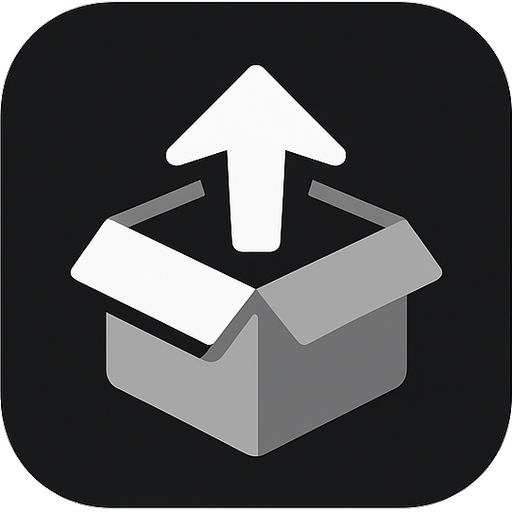

<div align="center">
  
  <br/>
  
</div>

A modern desktop application to launch applications and manage environments within the Rez package ecosystem.

## Table of Contents

- [Table of Contents](#table-of-contents)
- [Introduction](#introduction)
- [Key Features](#key-features)
- [Technologies Used](#technologies-used)
- [Installation](#installation)
  - [For Developers](#for-developers)
  - [Prerequisites](#prerequisites)
  - [Steps](#steps)
- [Usage](#usage)

## Introduction

RezLauncher is a desktop application designed to simplify the management and launching of software environments powered by the Rez package manager. It provides a user-friendly interface to configure, version, and deploy collections of software packages (stages) and their associated tools.

## Key Features

- **MongoDB Integration**: Connect to a MongoDB instance to store and retrieve package and stage configurations.
- **Dynamic URI Navigation**: Organize and access configurations using a hierarchical URI structure (e.g., `/Project/ModelingType/Application`).
- **Package Collection Management**:
    - Create and version package collections.
    - Define packages, inheritance, and associated tools for each collection.
- **Stage Management**:
    - "Bake" package collections into immutable stages.
    - View stage history and details.
    - Revert to previous stage versions.
    - Activate/deactivate stages.
- **Tool Launching**:
    - Launch Rez environments for selected package collections or stages directly into a terminal.
    - Launch individual tools associated with a collection or stage.
- **Configuration Modes**:
    - **Config Mode**: For setting up and managing package collections and baking stages.
    - **Launcher Mode**: For browsing and launching existing stages and tools.
- **User Interface**:
    - Intuitive Svelte-based frontend.
    - Light and Dark theme options.
    - Real-time logging panel for monitoring application activity.
- **Cross-Platform**: Built with Tauri for desktop compatibility.

## Technologies Used

- **[Svelte](https://svelte.dev/)**: Frontend framework for the user interface.
- **[Rust](https://www.rust-lang.org/)**: Backend language for core logic and Tauri integration.
- **[Tauri](https://tauri.app/)**: Framework for building cross-platform desktop applications with web frontends.
- **[MongoDB](https://www.mongodb.com/)**: Database for storing package and stage configurations.

## Installation

For most users, the easiest way to install RezLauncher is to download the latest release from the [GitHub Releases page](https://github.com/ClementHector/RezLauncher/releases). Download the appropriate installer for your operating system (e.g., `.msi` for Windows, `.dmg` for macOS, or `.AppImage`/`.deb` for Linux), and run it.

### For Developers

If you want to build the application from source or contribute to development, follow these steps:

### Prerequisites

- **Node.js and npm**: For managing frontend dependencies and running scripts. (Download from [nodejs.org](https://nodejs.org/))
- **Rust and Cargo**: For building the backend. (Install via [rustup.rs](https://rustup.rs/))
- **MongoDB**: (Optional, can be configured in-app) A running MongoDB instance if you want to persist configurations.

### Steps

1.  **Clone the repository:**
    ```bash
    git clone https://github.com/ClementHector/RezLauncher.git
    cd RezLauncher
    ```

2.  **Install frontend dependencies:**
    ```bash
    npm install
    ```

3.  **Build and run the application:**

    *   For development (with hot-reloading):
        ```bash
        npm run tauri dev
        ```
    *   For a production build:
        ```bash
        npm run tauri build
        ```
        The executable will be located in `src-tauri/target/release/`.

## Usage

1.  **Initial Setup**:
    *   On the first launch, if a MongoDB connection URI is not found in your settings, a configuration modal will appear.
    *   Enter your MongoDB connection string (e.g., `mongodb://localhost:27017`) and test the connection. The application will store this URI for future sessions.

2.  **Navigating Layers**:
    *   Use the "LAYERS" breadcrumb navigation at the top to define your working context.
    *   Select or add new options for Project, Modeling Type, and Application. This creates a URI path (e.g., `/MyProject/Character/Maya`) that filters the displayed package collections and stages.

3.  **Modes**:
    *   **Config Mode**:
        *   **Package Collections Panel**:
            *   Click "Create New" to define a new package collection for the current URI. Specify version, packages (e.g., `maya-2023`, `houdini-19.5`), inheritance, and tools.
            *   Click the "Bake" icon on a package collection to create a "Stage" from it. This typically involves generating an RXT file and saving it as a new, active stage.
            *   Click the "Edit" icon to create a new package collection based on an existing one.
        *   **Stages Panel**:
            *   View stages created for the current URI.
            *   Click the "Revert" icon to make an older version of a stage active.
    *   **Launcher Mode** (and generally available actions):
        *   **Package Collections / Stages Panels**:
            *   Click on a package collection or a stage to select it. This will populate the "Tools" panel.
            *   Click the "Load" (play) icon to open a Rez environment for the selected item in a new terminal.
        *   **Tools Panel**:
            *   View tools associated with the selected package collection or stage.
            *   Click the "Load" (play) icon next to a tool to launch that specific tool within the context of its parent collection/stage in a new terminal.

4.  **Interface**:
    *   **Home Button**: Resets the URI path to the root.
    *   **Refresh Button**: Reloads package collections and stages for the current URI.
    *   **Theme Toggle**: Switch between Light and Dark themes.
    *   **Logs Panel**: View real-time logs of application actions, successes, warnings, and errors at the bottom of the window.
